#  MedTrain Sync Process Documentation

## Overview
The **MedTrain Sync Process** automates the transfer of training session data — including JSON logs and PDF reports — from **local systems** to the **development (cloud) environment**.
This ensures seamless data sharing, auditability, and reliability across training centers.

---

##  Step-by-Step Process

### 1. Session Creation
**When:** A user completes a training session on a medical manikin.

**System Actions:**
- ✅ Saves session metadata into **local PostgreSQL database**
- ✅ Generates **PDF report** (performance summary)
- ✅ Creates **JSON data file** (raw sensor + event data)
- ✅ Stores both files in local storage (e.g., `/home/medtrain/logs/sessions/`)

---

### 2. Cron-Based Sync Activation
**Trigger:** A background cron job runs every **5 minutes**

**Example Cron Expression:**
*/5 * * * * /usr/bin/node /path/to/syncJob.js >> /var/log/medtrain/sync.log 2>&1

**System Actions:**
- 🔍 Scans local DB for unsynced sessions
- 🧾 Verifies PDF/JSON existence
- 📦 Queues new sessions for upload and sync

---

### 3. Cloud File Upload
**Process:** Uploads local files to **DigitalOcean Spaces (S3-compatible)**

**Files:**
- `session_<id>.pdf`
- `session_<id>.json`

**Example URLs:**
https://devSensorlog.nyc3.digitaloceanspaces.com/session_123.pdf

https://devSensorlog.nyc3.digitaloceanspaces.com/session_123.json

Each uploaded file returns a **public URL**, which is stored for reference in both databases.

---

### 4. Two-Phase Commit Process
To maintain **transactional integrity** between **local DB** and **development DB**, the sync service uses a **two-phase commit approach**:

#### Phase 1 – Prepare (Validation)
1. Validate session completeness (PDF + JSON + metadata)
2. Upload files to cloud (DigitalOcean)
3. Create a transaction record in the local DB (`sync_status = pending`)
4. Test connectivity with dev database

#### Phase 2 – Commit (Finalization)
1. Insert session data into **development database**
2. Update **file URLs** (PDF/JSON) in dev DB
3. Mark transaction as **committed** in local DB (`sync_status = done`)
4. Log success in local sync history

> ⚠️ If any step fails (e.g., upload or DB insert),
> the transaction is **rolled back** and retried in the next cron cycle.

---

### 5. Development Database Update
**Process:** Replicates and enriches session data in **dev environment**

**Actions:**
- 📥 Inserts session rows from local DB
- 🔗 Updates `pdf_url` and `json_url` columns
- 🎯 Maintains primary key mapping and integrity

---

### 6. Sync Completion
Once all operations succeed:
- 🏷️ Marks session as `synced = true` in local DB
- 🕒 Adds entry in `sync_history` table
- ⏭️ Excludes synced sessions from future scans

---

### 7. Development Team Access
The synced data becomes available instantly on the **MedTrain Dev Dashboard**:

- 👀 View session summaries
- 📥 Download JSON/PDF via cloud URLs
- 📊 Analyze performance and metrics
- 🔄 Real-time visibility across all connected devices

---

## System Architecture Diagram

```mermaid
graph TB
    A[🏥 User Session<br/>Medical Training] --> B[💻 Local Application<br/>Node.js Service]
    
    B --> C[🗃️ Local Database<br/>PostgreSQL]
    B --> D[📁 Local File Storage<br/>PDF + JSON Files]
    
    C --> E[⏰ Sync Scheduler<br/>Every 5 Minutes]
    D --> E
    
    E --> F[🔄 Two-Phase Commit<br/>Upload Process]
    
    F --> G[☁️ DigitalOcean Spaces<br/>Cloud File Storage]
    F --> H[🌐 Development Database<br/>PostgreSQL]
    
    G --> I[📊 MedTrain Dev Dashboard]
    H --> I
    
    subgraph "Local Environment"
        C
        D
    end
    
    subgraph "Sync Process"
        E
        F
    end
    
    subgraph "Development Environment"
        G
        H
        I
    end

    style A fill:#e1f5fe
    style B fill:#f3e5f5
    style C fill:#e8f5e8
    style D fill:#fff3e0
    style E fill:#fff9c4
    style F fill:#ffebee
    style G fill:#e0f2f1
    style H fill:#fce4ec
    style I fill:#e8eaf6
```

---

## Summary of Sync Lifecycle

| Stage | Action           | Responsibility     | Outcome                     |
| ----- | ---------------- | ------------------ | --------------------------- |
| **1** | Session Created  | Local Node Service | Data stored locally         |
| **2** | Cron Triggered   | Sync Service       | Unsynced sessions detected  |
| **3** | Upload Files     | S3 Client          | Files uploaded to cloud     |
| **4** | Two-Phase Commit | Sync Controller    | Data consistency ensured    |
| **5** | Update Dev DB    | API/DB Connector   | URLs & data stored in dev   |
| **6** | Mark Complete    | Local DB           | Session marked as synced    |
| **7** | Dev Access       | MedTrain UI        | Team can view/download data |

---

## Reliability & Retry Logic
- Retries every **cron cycle** if sync fails
- Each failure logged with reason (network, upload, or DB error)
- No duplicate inserts due to unique `session_id` validation
- Status flags used:
  - `pending` → `in_progress` → `done` → `error`

---

## Technical Components

| **Component**            | **Function**                               | **Analogy**               |
| ------------------------ | ------------------------------------------ | ------------------------- |
| **Local Database**       | Stores session details and metadata        | Personal Notebook         |
| **Local File Storage**   | Holds PDF reports and JSON data            | File Cabinet              |
| **DigitalOcean Spaces**  | Cloud-based file storage system            | Secure Google Drive       |
| **Development Database** | Centralized data for team access           | Shared Company Notebook   |
| **Sync Service**         | Automated data transfer + two-phase commit | Reliable Delivery Service |
| **Cron Job**             | Periodic trigger for sync process          | Alarm Clock               |

---

## Key Benefits

- 🔄 **Fully automated, self-healing sync pipeline**
- 🔒 **Secure data handling with S3-compatible cloud**
- 🧠 **Atomic data transfer (no partial syncs)**
- 📈 **Real-time data visibility for the dev team**
- ⚡ **Optimized for performance and low bandwidth**
- 🛠️ **Robust error handling + detailed logging**

---

## Summary
Every session goes through the following lifecycle:
1. Captured locally
2. Saved as JSON and PDF
3. Uploaded to DigitalOcean
4. Committed to Dev DB via two-phase sync
5. Marked as completed

> **Result:** A reliable, secure, and traceable sync from manikin → local system → MedTrain Cloud Dashboard.
